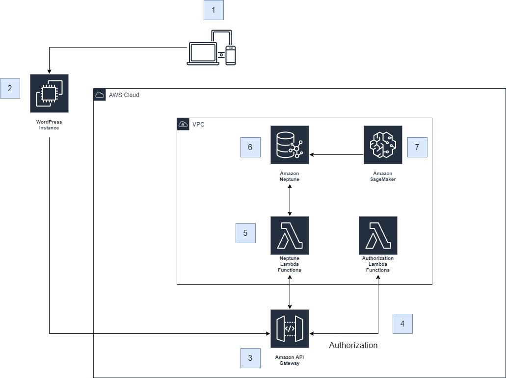
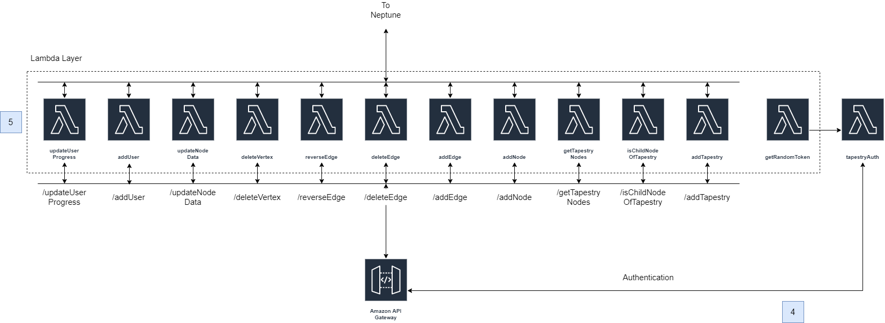
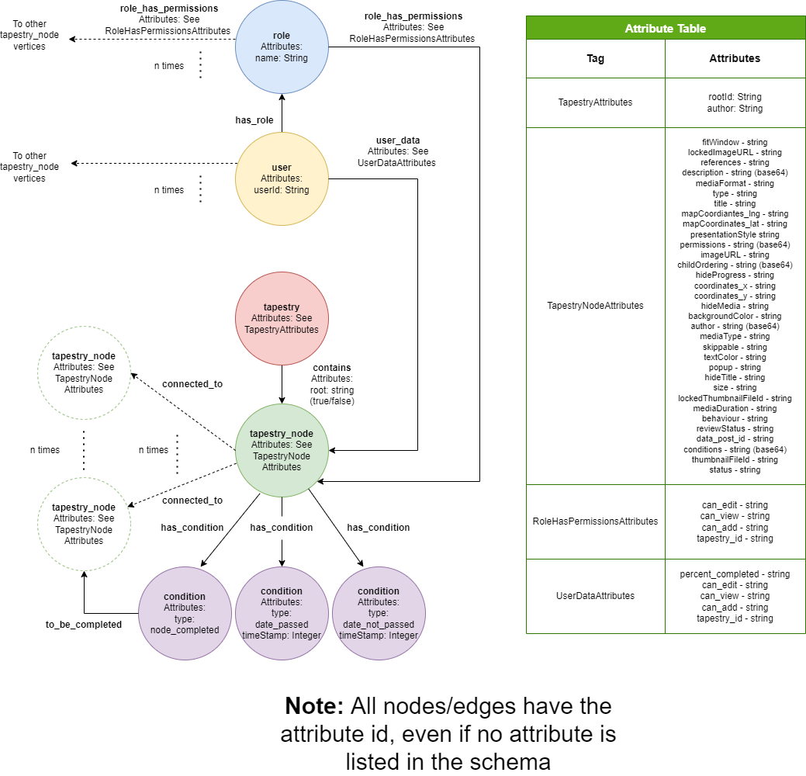

# Tapestry

The cloud infrastructre code and deployment guide for the Graph Database version of the WordPress plugin - Tapestry ([Website](https://www.home.tapestry-tool.com/)). This is a plugin for Wordpress that allows creating non-linear, collaborative, and interactive content. Originally designed to work using a relational database, this cloud deployment alongwith the Graph Database version of the [plugin](https://github.com/UBC-CIC/tapestry-wp-graphDB) aims to use Amazon Neptune as the primary database for the plugin, which would facilitate faster graph traversals for large Tapestries.

| Index                                                 | Description                                               |
|:------------------------------------------------------|:----------------------------------------------------------| 
| [High Level Architecture](#High-Level-Architecture)   | Architecture of the Cloud Component of the plugin         |
| [Database Schema](#database-schema)                   | Graph Database Schema                                     |
| [Deployment](#deployment)                             | How to deploy the project                                 |
| [User Guides](#User-Guides)                           | The working solution                                      |
| [Changelog](#Changelog)                               | Any changes post publish                                  |
| [License](#License)                                   | License details                                           |


# High Level Architecture
The overall cloud architecture can be summarized as follows.



The next diagram describes the microservice architecture (API Gateway and AWS Lambda functions) in more detail.



# Database Schema
The following is the schema of the graph database used in this project.



## Relational Database
Currently, the relational database stores all data in the wp tables as before. It just additionally stores all this data on Neptune as well, and in some cases, uses the post_ids or meta_ids generated to reference the data on Neptune as well. However, all data is fetched only from Neptune during a GET request. The only exception to this is Tapestry settings. Data entries that earlier had `meta_key = 'tapestry'` are now saved and loaded from the relational database with `meta_key = 'tapestry_settings'`. 

# Technical Considerations
Here are some technical considerations/decisions in this project and the reasoning behind them:
* **Base64 encoding:** The Neptune database stores a few node properties in base64 format. These properties are:
  ```bash
  description
  permissions
  conditions
  childOrdering
  author
  ```
  Out of these, the first one is directly encoded to base64 while the rest are first converted to JSON string and then to base64. The reason behind doing things   this way is that Neptune does not support storage of JSON. The presence of certain characters in the strings causes an error. These conversions take place in the plugin itself and not in the AWS Lambda functions.
* **Instance Types:** The Neptune database instance created by the CloudFormation template is of the type 'db.t3.medium'. This is a good choice for development and for smaller workloads due to its cheap pricing and decent performance. As workloads increase or if an increase in performance is desired, using a better instance type might be required. You can find the various instance types and their pricing [here](https://aws.amazon.com/neptune/pricing/).
* **Lamda Function Memory:** In the CloudFormation deployment, each AWS Lambda function has a memory of 512 MB. This has been found to be the minimum memory for a decent performance on the Gremlin queries. Increasing the memory on certain heavy functions like getTapestryNodes, addNode and updateNodeData might be another way of improving performance. However, this will also increase the AWS Lambda component of the pricing accordingly.   

# Deployment
To deploy this solution, please follow our [Deployment Guide](docs/deployment.md).

# User Guides
For details on how to use the Tapestry plugin, visit this [guide](https://www.home.tapestry-tool.com/guides).

# Changelog
N/A

# License
This project is distributed under the [MIT License](LICENSE).
