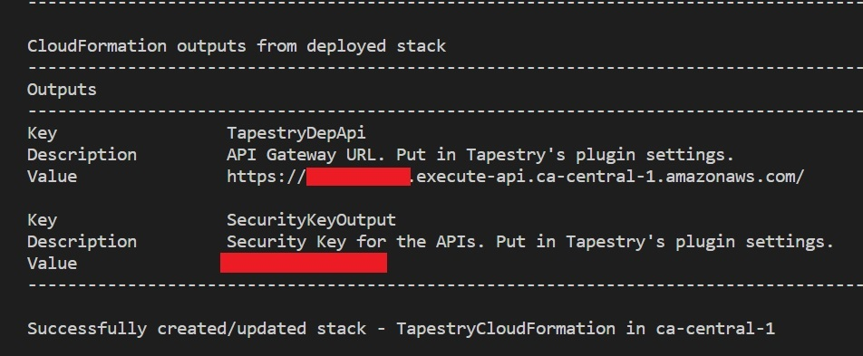
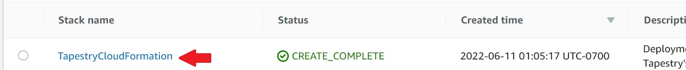
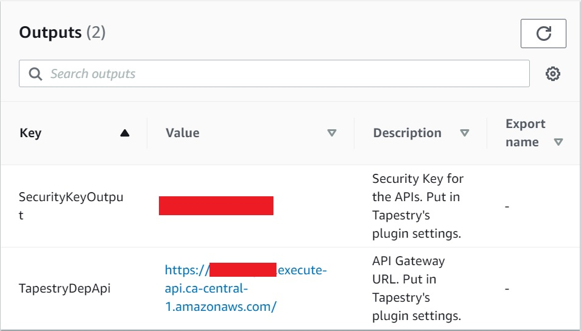
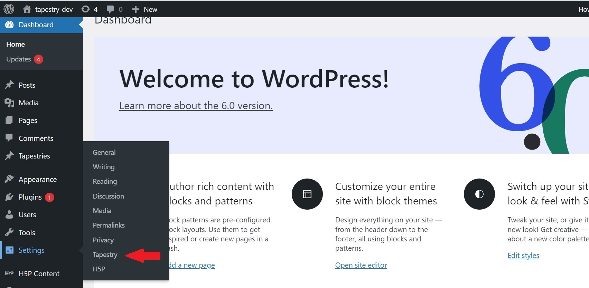
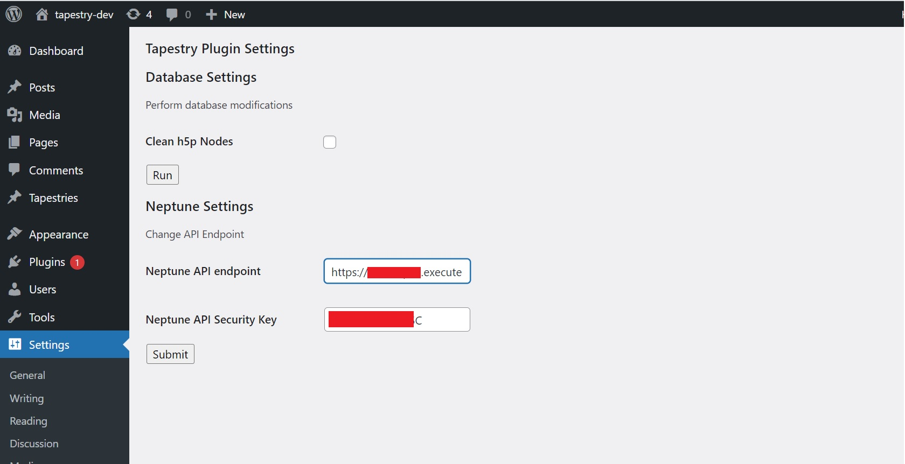

# Requirements

Before you deploy, you must have the following in place:

* A web server serving WordPress with the Tapestry Plugin installed (view instructions [here](https://github.com/UBC-CIC/tapestry-wp-graphDB#readme))
* [AWS Account](https://aws.amazon.com/account/)
* [GitHub Account](https://github.com/) 
* [Git](https://git-scm.com/book/en/v2/Getting-Started-Installing-Git)
* [Node/npm](https://nodejs.org/en/download/)
* [AWS CLI](https://aws.amazon.com/cli/) 
* [AWS SAM](https://docs.aws.amazon.com/serverless-application-model/latest/developerguide/serverless-sam-cli-install.html) 


# Step 1: Clone The Repository

1. Select a folder to hold the code in this repository, or create a new one.
2. Open the terminal (or command prompt on Windows) and **cd** into the above folder.
3. Clone this github repository by entering the following:
```bash
git clone https://github.com/UBC-CIC/Tapestry.git
```
Now navigate into the Tapestry folder by running the following command:
```bash
cd Tapestry
```

# Step 2: Cloud Deployment

In this section, we will create all the cloud resources for the Tapestry plugin to fucntion with Amazon Neptune as its primary database.

1. Navigate to the directory containing files for the AWS Lambda Layer and install the dependencies. This will create allow us to create a runtime for our AWS Lambda functions.
```bash
cd deployment/layer/nodejs
npm install
```

2. Navigate back to deployment folder.
```bash
cd ../../
```

3. Now, we use SAM (Serverless Application Model) to deploy our cloud resources. Run the following command:
```bash
sam build
```
Then, deploy the CloudFormation stack using:
```bash
sam deploy --guided
```
If you have multiple AWS Profiles, specify one with sufficient admin permissions by appending this to the command, replacing the profile name
```bash
--profile [PROFILE_NAME]
```

4. Answer the configuration questions as follows:
```bash
Configuring SAM deploy
======================

        Looking for config file [samconfig.toml] :  Not found

        Setting default arguments for 'sam deploy'
        =========================================
        Stack Name [sam-app]: TapestryCloudFormation
        AWS Region [ca-central-1]: 
        #Shows you resources changes to be deployed and require a 'Y' to initiate deploy
        Confirm changes before deploy [y/N]: y
        #SAM needs permission to be able to create roles to connect to the resources in your template
        Allow SAM CLI IAM role creation [Y/n]: y
        #Preserves the state of previously provisioned resources when an operation fails
        Disable rollback [y/N]: n
        Save arguments to configuration file [Y/n]: n
```
Prompts in square brackets represent default values if no answer is provided. In this case, the AWS Region is going to be ca-central-1.
Once the changeset is created, answer yes to deploy.
```bash
Previewing CloudFormation changeset before deployment
======================================================
Deploy this changeset? [y/N]: y
```
You should now see multiple resources being provisioned in the terminal/command prompt. These are the resources that Tapestry is going to use. Alternatively, you can also check the status of the deployment in the [AWS Console](https://aws.amazon.com/) by signing in, searching for CloudFormation, and selecting your stack under 'Stacks'.

5. Once the deployment is successful, you should see outputs like this in your terminal:



Alternatively, you can also see the outputs in the AWS Console:
* Sign in to the AWS Console.
* Search for CloudFormation.
* Under 'Stacks', click on the recently created CloudFormation stack



* Click on the 'Outputs' tab on your right. You should see the same outputs as in the terminal.



# Step 3: Plugin Configuration

We have now successfully provisioned all cloud resources for the Tapestry plugin to function properly. Now, we need to use the outputs from our CloudFormation deployment, to configure a couple of settings for our plugin.

* Open the WordPress admin dashboard. On your left-hand side, hover over settings. If you set the plugin up correctly, you should see a 'Tapestry' option among the various options. Click on that.



* You should see a section for Neptune Settings. Copy and paste your CloudFormation outputs into these. Copy and paste the value of 'TapestryDepApi' into the box labelled 'Neptune API endpoint' and the value of 'SecurityKeyOutput' into the box labelled 'Neptune API Security Key'.



* Click on 'Submit'. You should be logged out of the admin dashboard. Once you log back in, you should be able to use the Tapestry plugin.

Congratulations! You can now begin creating Tapestries using Amazon Neptune as the primary database.
