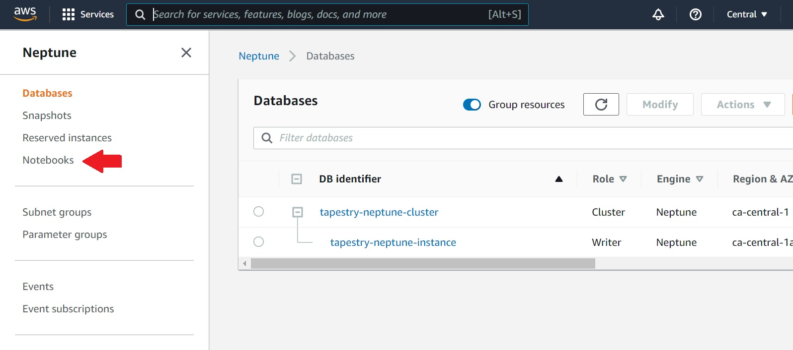
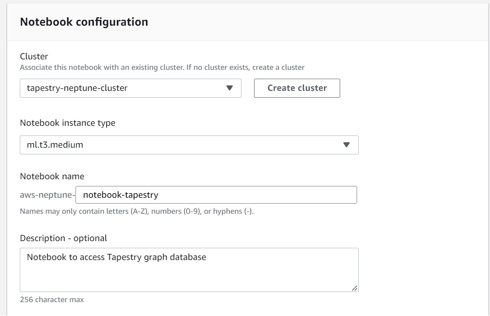
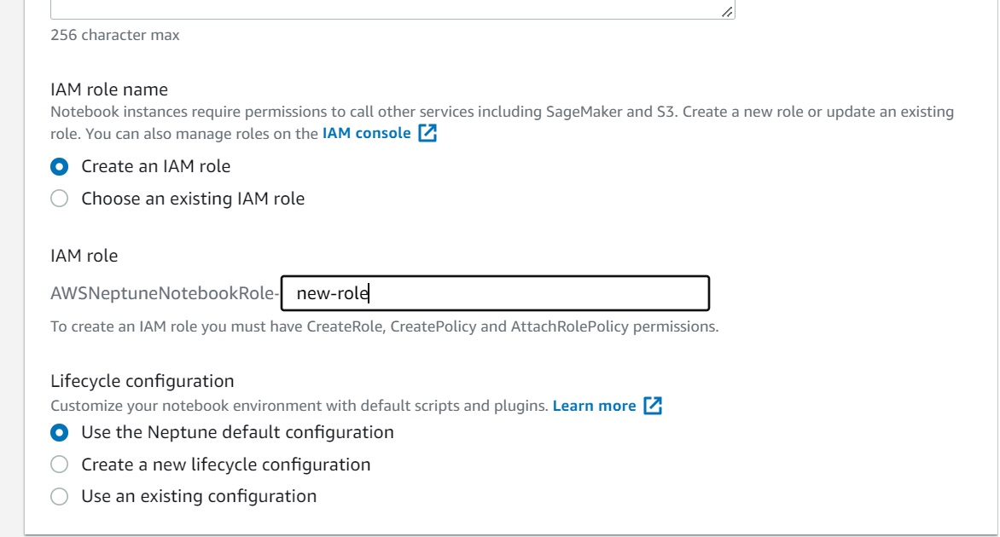
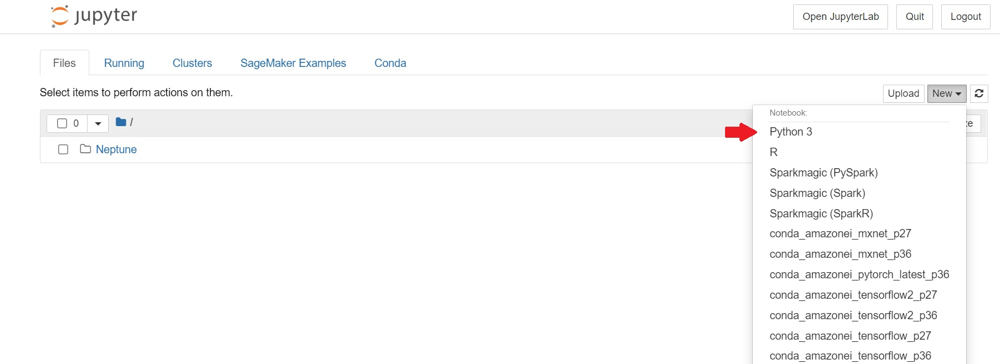

# Setting up Amazon SageMaker for use with Amazon Neptune

Follow these steps to add a SageMaker notebook for use with Amazon Neptune.

* Go the the AWS Console and search for Neptune.

* On the Neptune page, click on the 'Notebooks' option on the left.

  

* Click on 'Create notebook'.

* Under Notebook configuration:
  * Under the 'Cluster' section, choose the cluster we recently created for Tapestry using SAM (if you haven't done that yet, follow the [deployment guide](deployment.md) to do that first).
  * Under 'Notebook instance type' choose an instance type for e.g. 'ml.t3.medium'.
  * Next, give a name (and optionally a description) to your notebook.
  * Under IAM role name, choose 'Create an IAM role' and give a name to thenewly created role.
  * Finally, under 'Lifecycle configuration', use 'Use the Neptune default configuration'.
  * Click on 'Create notebook'.

  

  

* Wait for the notebook to be created. Once it is ready, select the notebook and click on 'Open notebook'.

* Here, you can create a Python 3 notebook and start using Gremlin to query the database.

 

